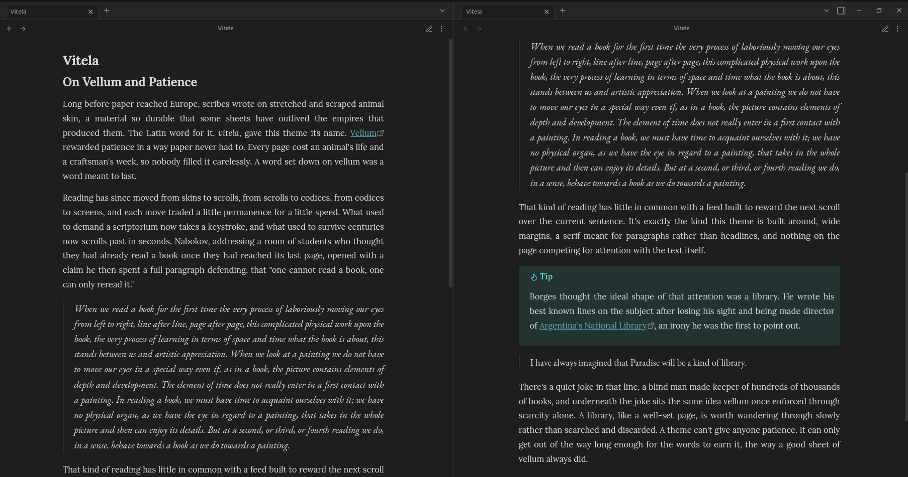
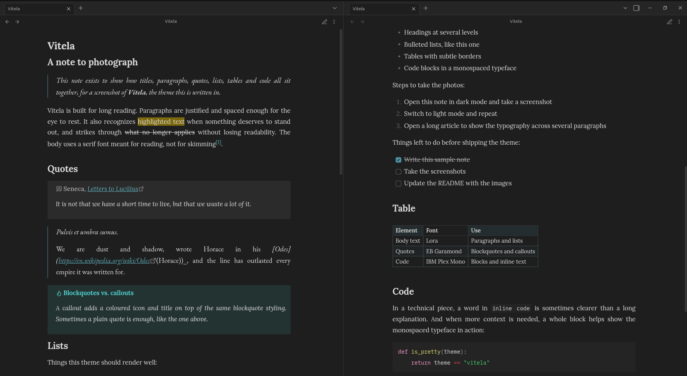
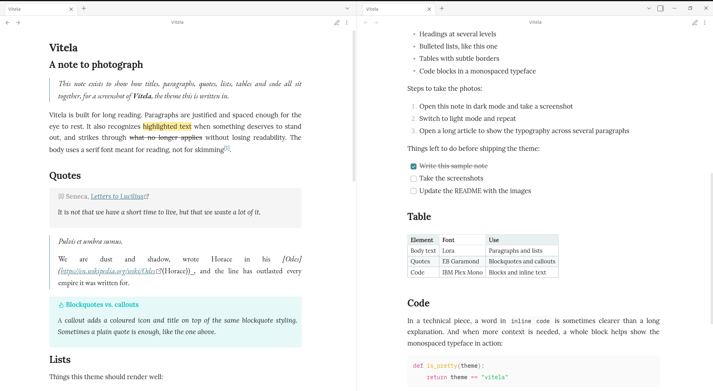
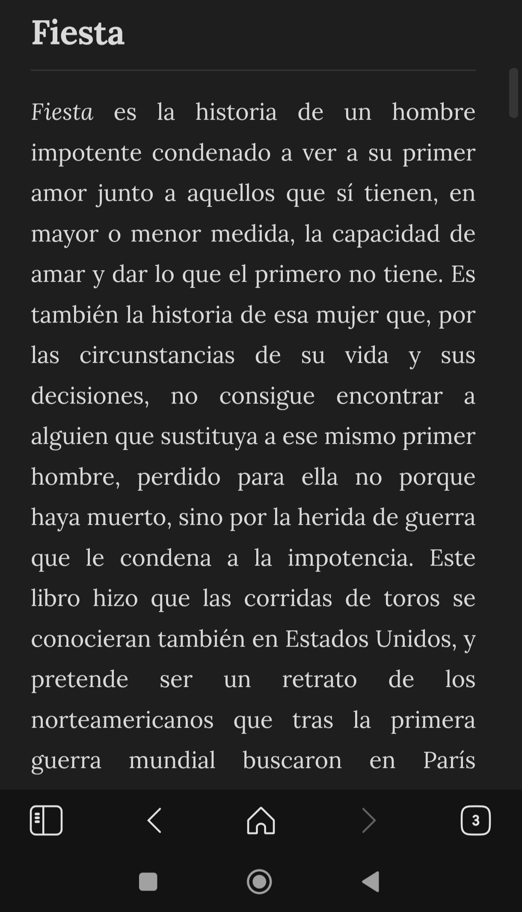
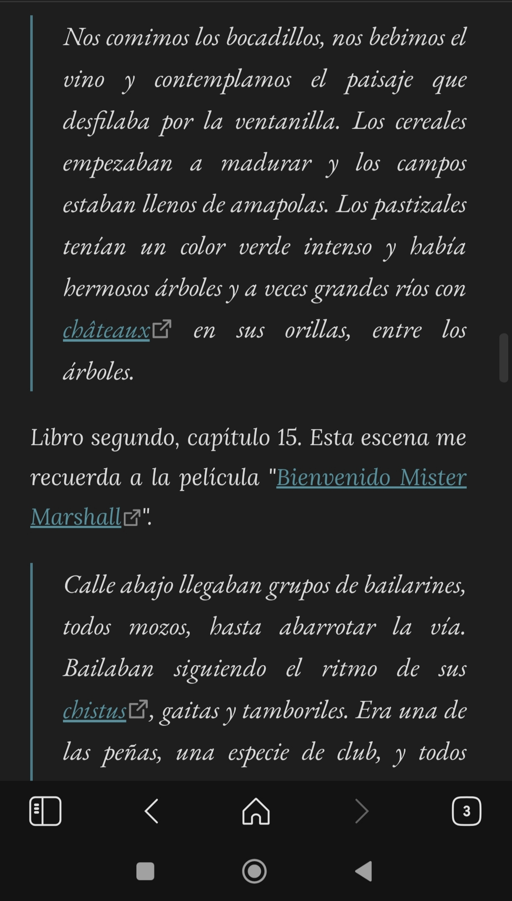
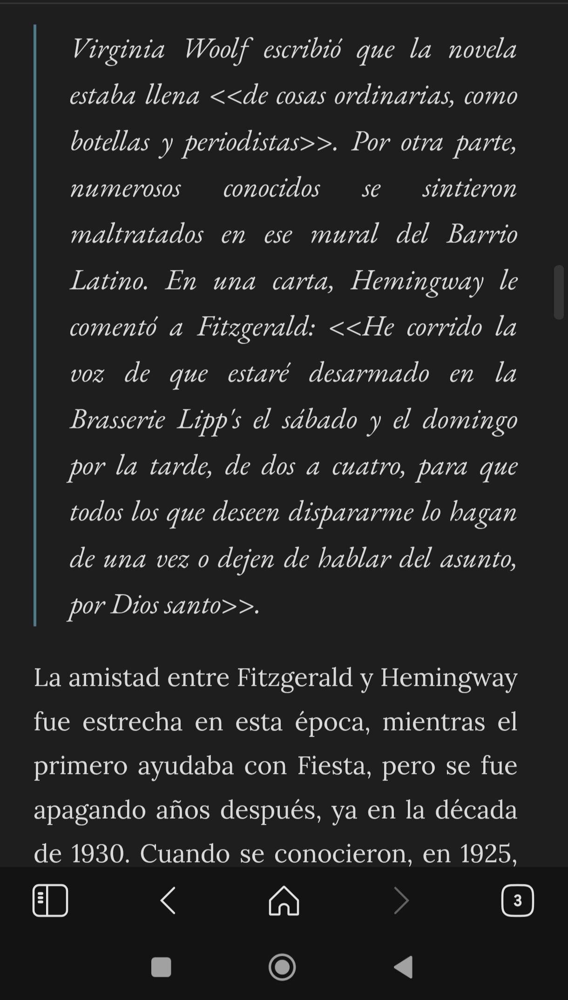

# obsidian-vitela


A serif Obsidian theme designed for long-form reading and writing.

Vitela prioritises typography, comfortable reading and sensible defaults over endless customization, making notes feel closer to a well-designed book than a code editor while remaining lightweight, accessible and compatible with Obsidian Publish.



Ideal for writers, researchers, students and anyone who spends hours reading and writing in Obsidian.

## Why Vitela?

* **Typography first.** Lora is used for body text, EB Garamond for quotations and IBM Plex Mono for code, each selected for its intended role.
* **Comfortable reading.** Justified paragraphs with automatic hyphenation produce cleaner text blocks during long reading sessions.
* **A quieter interface.** A restrained teal accent replaces Obsidian's default purple, while tables use subtle accent-tinted borders and alternating row colours.
* **Accessible by default.** Font sizes use `rem`, so the theme respects the reader's preferred text size instead of overriding it.
* **Privacy-friendly.** Fonts are bundled with the theme instead of being loaded from external services.
* **Publish-ready.** A matching `publish.css` keeps published notes visually consistent with the desktop experience.

## Design principles

Vitela deliberately favours carefully chosen defaults over extensive configuration. Every visual decision aims to improve readability, reduce distraction and maintain a consistent typographic rhythm throughout the vault.

Rather than exposing countless configuration options, Vitela focuses on providing a polished reading and writing experience that works well out of the box.

## Screenshots





  

## Installation

1. Download or clone this repository.
2. Copy the folder into `<vault>/.obsidian/themes/`. The containing folder name does not matter; Obsidian discovers themes by locating `manifest.json` files.
3. Open **Settings → Appearance → Themes** and select **obsidian-vitela**.

## Using with Obsidian Publish

Obsidian Publish does not load local theme files from a vault.

To use Vitela with a published site, copy `publish.css` into the root of the published vault. Obsidian Publish automatically detects and applies it.

## Technical notes

### Fonts

Vitela ships with its own font files instead of loading them from Google Fonts.

The bundled fonts include the Latin subset of Lora, EB Garamond and IBM Plex Mono, covering English, Spanish and most other Latin-script languages. Bundling the fonts avoids external requests, preserves visitor privacy by preventing IP leakage to third-party font providers and ensures consistent rendering both locally and in Obsidian Publish.

The fonts are embedded as Base64. Obsidian blocks network requests from theme CSS, while Obsidian Publish's asset pipeline accepts standalone images, audio, video and PDF files but not font files. Embedding the fonts avoids these limitations and provides a reliable solution in both environments.

### Build process

`theme.css` is the project's single source of truth.

`publish.css` is generated automatically from it by removing the editor-only portions of selectors, since published notes do not include Live Preview. This guarantees that both stylesheets remain synchronized without duplicated maintenance.

After modifying `theme.css` or any file under `fonts/`, run:

```sh
./scripts/build.sh
```

This script first regenerates the embedded font definitions inside `theme.css`, then regenerates `publish.css`.

The individual steps are also available separately:

* `scripts/build-fonts.sh`
* `scripts/build-publish-css.sh`

### Repository layout

```python
File                          Purpose
────────────────────────────  ─────────────────────────────────────────
theme.css                     Main stylesheet (source of truth)
publish.css                   Generated stylesheet for Obsidian Publish
fonts/                        Bundled font files
scripts/build.sh              Rebuild fonts and publish.css
scripts/build-fonts.sh        Regenerate embedded font definitions
scripts/build-publish-css.sh  Generate publish.css from theme.css
```

## Changelog

See [CHANGELOG.md](CHANGELOG.md) for the project's version history.

## License

The theme itself is licensed under the MIT License. See [LICENSE](LICENSE).

The bundled fonts are licensed separately under the SIL Open Font License 1.1 by their respective authors. See:

* `fonts/LICENSE-lora.txt`
* `fonts/LICENSE-eb-garamond.txt`
* `fonts/LICENSE-ibm-plex-mono.txt`
